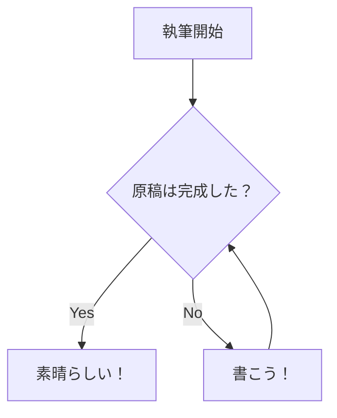

# Mermaidで図を書く

ソースコードのような形で作図をするためのMermaid.jsというものがある。最近はこれに対応したソフトも増えてきた。作図ができるため、本を書くのにはとても便利だ。



mermaid記法の書き方は次の通り。

````md

````

ただし残念ながらVivlioStyle公式ではサポートされていないが、多少頑張って導入しなければ使えない。

## インストールをする

Zennで[Vivliostyle (v8.16.0+) で mermaid.js の図を表示する](https://zenn.dev/mura_mi/articles/4f08cc99f19887)という記事が公開されているのでその通りにやると良い。

1. `vivliostyle.config.js` のファイル名を `vivliostyle.config.mjs` に変更する
2. `rehype-mermaid` と、その依存関係で必要となる `playwright` をインストールする
3. playwrightの都合で `bunx playwright install` を実行する
4. `vivliostyle.config.mjs` に `rehype-mermaid` を使うように修正する

という手順が必要だ。

### 4. `vivliostyle.config.mjs` に `rehype-mermaid` を使うように修正する

まず`vivliostyle.config.mjs`の先頭で、必要なパッケージを読み込む。

```js:必要なパッケージを読み込む
import { VFM } from "@vivliostyle/vfm";
import rehypeMermaid from "rehype-mermaid";
```

次に`module.exports = {` を `export default {` に書き換える。

最後に、設定を追加する。

```js:設定を追加する
  documentProcessor: (config, metadata) => {
    return VFM(config, metadata).use(rehypeMermaid, {strategy: 'img-png'});
  },
```

