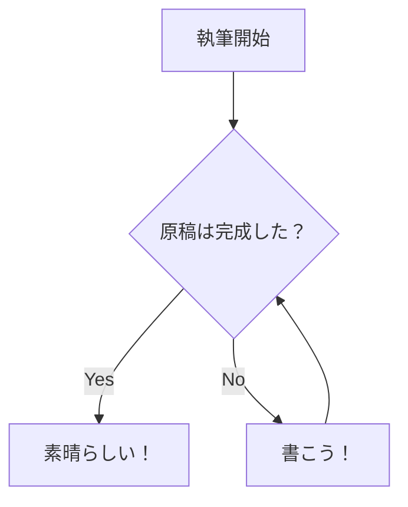

# Markdown

VivlioStyleではHTMLもしくはMarkdownで原稿を書きますが、よほど奇特な人でも無い限りMarkdownで書くことを強く推奨します<span class="footnote">とは言え、MarkdownはHTMLほどの表現力はないため、どうしても特定の凝ったページではHTMLで書く必要性がでてきます。</span>。

Markdownとは、元々英語のメールなどテキストコミュニケーションでよく使われる装飾を元に、とても自然な文章っぽく、HTMLの機能の一部を実現できる書式です。とても簡単、かつ様々なところで使われているため是非とも覚えましょう。全世界的な標準の仕組みです。

この章では、特に断りが無い限りはMarkdownの中でも、VivlioStyleで使用可能なVFM<span class="footnote">Vivlio Fravored Markdownの略で、GitHubで使われるGFMの亜種のようなものです。GFMはGitHub Fravored Markdownの略です。</span>という書式について紹介します。

全部を紹介していると分量が多くなりすぎるため、いったんよく使う記法をまとめました。

以後の内容では、まず例文を出して、その例文を再現するためのMarkdown記法を書きます。

この章のソースコード自体を見るのが手っ取り早いかもしれません。

## 文

Markdownにおける文は、
改行の影響を受けますが、
単に改行を入れるだけでは、
別の改行はされません。

空行を入れることで別の文とみなされるようになります。

```md
Markdownにおける文は、
改行の影響を受けますが、
単に改行を入れるだけでは、
別の改行はされません。

空行を入れることで別の文とみなされるようになります。
```

この特性をよく覚えていてください。ただし、こだわりポイントとして、改行は「空白文字」として解釈されてしまうため、「Markdownにおける文は、」と「改行の影響を受けますが、」の間に小さな空白が入ってしまいます。そのため、どうしてもこだわる人は、改行を入れない方が良いでしょう。

* 改行は一文字の空白文字として扱われる
* 空行を入れるとその前後は別の文として扱われる

なお設定で、改行を無視しないようにすることも可能です。また `<br />` と書くと意図的に改行をいれることもできます。

Markdownにおける文は、<br />
改行の影響を受けますが、
単に改行を入れるだけでは、<br />
別の改行はされません。

```md
Markdownにおける文は、<br />
改行の影響を受けますが、
単に改行を入れるだけでは、<br />
別の改行はされません。
```

## 見出し

技術書のような装丁の文章には見出しがあります。通常は「章」「節」などの階層構造になっています。たとえば今の文章は「Markdown」の章にある「見出し」の節の文章です。

<!-- なぜかコードブロックがバグるので、4スペースインデントによるコードブロックを採用 -->
    # Markdown

    VivlioStyleではHTMLもしくはMarkdownで原稿を書きます。よほど奇特な人でも無い限りMarkdownで書くことを強く推奨します。

    ## 見出し

    技術書のような装丁の文章には見出しがあります。通常は「章」「節」などの階層構造になっています。たとえば今の文章は「Markdown」の章にある「見出し」の節の文章です。
<!-- -->

このような構造になっています。ハッシュ文字と空白一文字 `# ` が見出しです。

|書き方|内容|
|-----|---|
|`# `|章の見出し|
|`## `|節の見出し|
|`### `|項の見出し|
|`#### `|第四階層の見出し|
|`##### `|第五階層の見出し|
|`###### `|第六階層の見出し|

第六階層まで見出しを設定できますが、章・節・項の三階層までに絞るのが一般的です。というか普通は、章と節だけで十分です。どうしても細かい単位を扱いたいときに項を使うことがあります。

## インラインコード

インラインコードとは、たとえば変数名 `worldCount` など「間違ってはいけない固有のもの」を強調するために使います。

```md:インラインコード
インラインコードとは、たとえば変数名 `worldCount` など「間違ってはいけない固有のもの」を強調するために使います。
```

このように、バッククォートで囲いましょう。バッククォートはJISキーボードなら `Shift+@` で入力できます。

## 強調・イタリック・取り消し線

**強調**や*イタリック*や、~~取り消し線~~などがあります。

```md:強調・イタリック・取り消し線
**強調**や*イタリック*や、~取り消し線~などがあります。
```

まぁ、普通使うのは **強調** くらいでしょうか？~~少し不真面目な文体なら~~取り消し線も使い勝手がいいかもしれません。

## 箇条書きリスト

箇条書きは専用の書式があります。

* 箇条書き
* かじょうがき

```md:*による箇条書きリスト
* 箇条書き
* かじょうがき
```

```md:-による箇条書きリスト
- 箇条書き
- かじょうがき
```

アスタリスクとスペース `* ` もしくは、ハイフンとスペース `- ` で箇条書きになります。混在することも可能です。

`* ` `- ` の前に字下げをすることで階層構造も作れます。

* トップ
    * セカンド
        * サード
        * サード
        * サード
    * セカンド
        * サード
            * フォース
                * フィフス
                    * シックス
* トップ

```md:箇条書きの階層構造
* トップ
    * セカンド
        * サード
        * サード
        * サード
    * セカンド
        * サード
            * フォース
                * フィフス
                    * シックス
* トップ
```

どこまでも階層を作れますが、せいぜい二階層程度にしましょう。深すぎる階層は読者が混乱しがちです。

## 数字付きリスト

1. 最初にすること
1. 2番目にすること
1. 3番目にすること

```md:数字付きリスト
1. 最初にすること
1. 2番目にすること
1. 3番目にすること
```

`1. ` から始まるものは数字付きリストになります。このとき、じつは数字は適当でも大丈夫です。全部 `1. ` でもいい感じに解釈してくれます。もちろん著者が頑張って正しい数字にしてもいいです。

<div class="column">
<div class="column-title">箇条書きは多くのソフトで使える</div>
たとえば、Macの標準アプリに「メモ」があります。メモではMarkdownと同じく、アスタリスク・スペースで過剰書きモードになります。


このような挙動をするソフトは割とあり、たとえばSlackなんかもそうです。箇条書きに対応しているソフトを見つけたら、アスタリスク・スペースを入力してみてください。これが使えると作業効率が上がります。
</div>

## コードブロック

コードブロックとは、ソースコードの提示などに使います。

```ts
// TypeScript
const hoge = "ほげ"
```

````md:コードブロックの書き方
コードブロックとは、ソースコードの提示などに使います。

```ts
// TypeScript
const hoge = "ほげ"
```
````

コードブロックは ` ``` ` で囲ったブロックです。` ```ts ` ` ```typescript ` や ` ```md ` ` ```markdown `のように、言語の種類を与えると、その言語として解釈し色分けをしてくれます。

<!--
コードブロックを<a href="#code-block" data-ref="fig"></a>という風に参照できます。

```md
コードブロックを<a href="#code-block" data-ref="figure"></a>という風に参照できます。
```
-->


ちなみにコードブロックの中でコードブロックを書きたい場合は、外側のコードブロックのバッククォートの数を増やしましょう。

`````md
ちなみにコードブロックの中でコードブロックを書きたい場合は、外側のコードブロックのバッククォートの数を増やしましょう。

````md
コードブロックとは、ソースコードの提示などに使います。

```ts
// TypeScript
const hoge = "ほげ"
```
````
`````

またそのコードの名称を与えることもできます。

```ts:変数定義
const hoge = "ほげ"
```

````md:変数定義という名称を与えた
```ts:変数定義
const hoge = "ほげ"
```
````

コードブロックが横に長い場合は自動的に改行が入ります。

```
寿限無寿限無五却のすりきれ海砂利水魚の水行末雲来末風来末食う寝る処に住む処藪ら柑子の藪柑子パイポパイポパイポのシューリンガンシューリンガンのグーリンダイグーリンダイのポンポコピーのポンポコナーの長久命の長助
```

## 表

Markdownでは表を書くことができます。ただしMarkdownの中でも表は「方言」に属するため、どのMarkdown処理系でも同じ書き方で使える都は限りません。ここではVivlioStyleで書くためのVFMでの表について説明します。

名前|対応書式|拡張子|特徴
---|--------|-----|----
Re:VIEW|Re:VIEW専用フォーマット|.re|技術同人誌を書くのに、最も完成されたソフト
VivlioStyle|Markdown|.md|CSS組版で自由度の高い本を書けるソフト

```md:表
名前|対応書式|拡張子|特徴
---|--------|-----|----
Re:VIEW|Re:VIEW専用フォーマット|.re|技術同人誌を書くのに、最も完成されたソフト
VivlioStyle|Markdown|.md|CSS組版で自由度の高い本を書けるソフト
```

このような記法です。ちなみに、外側に `|` を追加しても同じように表になります。

```md:表
|名前|対応書式|拡張子|特徴|
|---|--------|-----|----|
|Re:VIEW|Re:VIEW専用フォーマット|.re|技術同人誌を書くのに、最も完成されたソフト|
|VivlioStyle|Markdown|.md|CSS組版で自由度の高い本を書けるソフト|
```

外側に `|` がある方が分かりやすいという考え方もあるかもしれません。どっちでも大丈夫です。

## MarkdownではHTMLを埋め込める

MarkdownにそのままHTMLを書けばHTMLとして埋め込まれます。たとえば、本書で採用しているテーマでは `flush-right` というクラスを指定すると、右寄せになります。

<div class="flush-right">@erukiti</div>

```md
<div class="flush-right">@erukiti</div>
```

## 脚注

本文とはズレた内容や、リンク先などを脚注に出すことで、必要な情報を記載しつつ、本文の流れを維持できます。<span class="footnote">脚注を読むのが楽しみという人も一定いるかもしれませんが、読まない人も一定数いるのでご注意を。</span>。

```md:脚注
本文とはズレた内容や、リンク先などを脚注に出すことで、必要な情報を記載しつつ、本文の流れを維持できます。<span class="footnote">脚注を読むのが楽しみという人も一定いるかもしれませんが、読まない人も一定数いるのでご注意を。</span>。
```

<div class="column">
<div class="column-title">Markdownの歴史</div>

Markdownと似たようなことをする書式は実は無限といえるくらいあります。たとえばWikipediaは、MediaWikiというシステムで動いていて、MediaWikiの書式があります。また、Wikiの元祖であるWikiWikiWebの書式もありますしWiki系の書式は数十種類以上あります。

元々様々な書式が乱立していて、互換性に苦しんでいたため、Markdownという「人類の共通言語」が登場したことは、当時の界隈にとって重要なことでした。

GitHub, Notion, Confluence他、様々なシェアトップのツールが、Markdown記法を採用しています。SlackなんかはMarkdownのサブセットを採用しています。

オリジナルのMarkdownは200x年に登場したもので、オリジナルの作者はそれ以上の改良をやらなかったため、様々な方言が生み出されました。

これはWikiと同じ悪夢を生み出すかと思われましたが、GitHubという巨大勢力によりGitHub Flavored Markdownが、ほぼ業界標準になっています。

</div>

## 画像


```md

```

{id=erukiti-icon}

```

```

文章中に筆者のアイコン画像を16px指定で{width=16px}を出すことで絵文字のように扱えます。

```md
文章中に筆者のアイコン画像を16px指定で{width=16px}を出すことで絵文字のように扱えます。
```

{width=100%}

```
{width=100%}
```

## リンク

印刷版には関係ないといえば関係ないですが、電子版ではリンクを活かしたいことも多々あります。

本文のキーワードにリンクを仕込むことはできますが、リンクがあることに気付きづらいので、脚注と併用することをお勧めします。

[首相官邸](https://www.kantei.go.jp/)

```md
[タイトル](リンク)
[首相官邸](https://www.kantei.go.jp/)
```

## Mermaidで図を描く

ソースコードのような形で作図をするMermaid.jsというソフトがあります。最近はこれに対応したものが増えているため、Mermaidの記法を覚えておくと便利です。このリポジトリでもMermaid対応をしています。



mermaid記法の書き方は次の通りです。

````md

````
