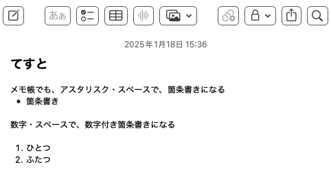

# Markdown

VivliostyleではHTMLもしくはMarkdownで原稿を書けます。よほど凝ったレイアウトでもしなければMarkdownで書くことを強く推奨します<span class="footnote">とは言え、MarkdownはHTMLほどの表現力はないため、どうしても特定の凝ったページではHTMLで書く必要性がでてきます。</span>。

この章では、Vivliostyleで使用可能なVFM<span class="footnote">Vivliostyle Flavored Markdownの略で、GitHubで使われるGFM(GitHub Flavored Markdown)と共通点の多いMarkdownの拡張版のようなものです。</span>というMarkdownで原稿を書くための書式について紹介します。

全部を紹介していると分量が多くなりすぎるため、いったんよく使う記法をまとめました。

この章ではまず例文を出して、その例文を再現するためのMarkdown記法を書きます。

## 文（Markdown標準）

Markdownにおける文では、
改行一つでは、
実際に改行は行われません。

改行を二つ以上、つまり空行を入れることで別の文とみなされるようになります。

```md
Markdownにおける文では、
改行一つでは、
実際に改行は行われません。

改行を二つ以上、つまり空行を入れることで別の文とみなされるようになります。
```

この特性をよく覚えていてください。ただし、こだわりポイントとして、改行は「空白文字」として解釈されてしまうため、「Markdownにおける文では、」と「改行一つでは」の間に小さな空白が入ってしまいます。そのため、どうしてもこだわる人は、改行を入れない方が良いでしょう。

* 改行は一文字の空白文字として扱われる
* 空行を入れるとその前後は別の文として扱われる

なお設定で、改行を無視しないようにすることも可能です。また `<br />` と書くと意図的に改行をいれることもできます。

Markdownにおける文では、<br/>
改行一つでは、
実際に改行は行われません。

```md
Markdownにおける文はでは、<br/>
改行一つでは、
実際に改行は行われません。
```

## 見出し（Markdown標準）

技術書のような装丁の文章には見出しがあります。通常は「章」「節」などの階層構造になっています。たとえば今ある、この文章は「Markdown」の章にある「見出し」の節の中にある文章です。

<!-- なぜかコードブロックがバグるので、4スペースインデントによるコードブロックを採用 -->
    # Markdown

    VivliostyleではHTMLもしくはMarkdownで原稿を書きます。よほど奇特な人でも無い限りMarkdownで書くことを強く推奨します。

    ## 見出し

    技術書のような装丁の文章には見出しがあります。通常は「章」「節」などの階層構造になっています。たとえば今ある、この文章は「Markdown」の章にある「見出し」の節の中にある文章です。
<!-- -->

このような構造になっています。ハッシュ文字と空白一文字 `# ` が見出しです。

|書き方|内容|
|-----|---|
|`# `|章の見出し|
|`## `|節の見出し|
|`### `|項の見出し|
|`#### `|第四階層の見出し|
|`##### `|第五階層の見出し|
|`###### `|第六階層の見出し|

第六階層まで見出しを設定できますが、章・節・項の三階層までに絞るのが一般的です。というか普通は、章と節だけで十分です。どうしても細かい単位を扱いたいときに項を使うことがあります。

## インラインコード(Markdown標準)

インラインコードとは、たとえば変数名 `worldCount` など「間違ってはいけない固有のもの」を強調するために使います。技術書の場合、変数名、クラス名などに使うことが多いでしょう。

```md:インラインコード
インラインコードとは、たとえば変数名 `worldCount` など「間違ってはいけない固有のもの」を強調するために使います。技術書の場合、変数名、クラス名などに使うことが多いでしょう。
```

このように、バッククォートで囲いましょう。バッククォートはJISキーボードなら `Shift+@` で入力できます。

## 強調・イタリック・取り消し線（Markdown標準）

**強調**や*イタリック*や、~~取り消し線~~などがあります。

```md:強調・イタリック・取り消し線
**強調**や*イタリック*や、~取り消し線~などがあります。
```

まぁ、普通使うのは**強調**くらいでしょうか？~~少し不真面目な文体なら~~取り消し線も使い勝手がいいかもしれません。

## 箇条書きリスト（Markdown標準）

箇条書きは専用の書式があります。

* 箇条書き
* かじょうがき

```md:*による箇条書きリスト
* 箇条書き
* かじょうがき
```

```md:-による箇条書きリスト
- 箇条書き
- かじょうがき
```

アスタリスクとスペース `* ` もしくは、ハイフンとスペース `- ` で箇条書きになります。混在することも可能です。

`* ` `- ` の前に字下げをすることで階層構造も作れます。

* トップ
    * セカンド
        * サード
        * サード
        * サード
    * セカンド
        * サード
            * フォース
                * フィフス
                    * シックス
* トップ

```md:箇条書きの階層構造
* トップ
    * セカンド
        * サード
        * サード
        * サード
    * セカンド
        * サード
            * フォース
                * フィフス
                    * シックス
* トップ
```

どこまでも階層を作れますが、せいぜい二階層程度にしましょう。深すぎる階層は読者も混乱するでしょう。

## 数字付きリスト（Markdown標準）

1. 1番目にすること
1. 2番目にすること
1. 3番目にすること

```md:数字付きリスト
1. 1番目にすること
1. 2番目にすること
1. 3番目にすること
```

`1. ` から始まるものは数字付きリストになります。このとき、じつは数字は適当でも大丈夫です。全部 `1. ` でもいい感じに解釈してくれます。もちろん著者が頑張って正しい数字にしてもいいです。

<div class="column">
<div class="column-title">箇条書きは多くのソフトで使える</div>
　たとえば、Macの標準アプリに「メモ」があります。メモではMarkdownと同じく、アスタリスク・スペースで過剰書きモードになります。

{width=500px}

このような挙動をするソフトは割とあり、たとえばSlackなんかもそうです。箇条書きに対応しているソフトを見つけたら、アスタリスク・スペースを入力してみてください。これが使えると作業効率が上がります。
</div>

## コードブロック（Markdown標準）

コードブロックとは、ソースコードの提示などに使います。

```ts
// TypeScript
const hoge = "ほげ"
```

````md:コードブロックの書き方
コードブロックとは、ソースコードの提示などに使います。

```ts
// TypeScript
const hoge = "ほげ"
```
````

コードブロックは ` ``` ` で囲ったブロックです。` ```ts ` ` ```typescript ` や ` ```md ` ` ```markdown `のように、言語の種類を与えると、その言語として解釈し色分けをしてくれます。

<!--
コードブロックを<a href="#code-block" data-ref="fig"></a>という風に参照できます。

```md
コードブロックを<a href="#code-block" data-ref="figure"></a>という風に参照できます。
```
-->


ちなみにコードブロックの中でコードブロックを書きたい場合は、外側のコードブロックのバッククォートの数を増やしましょう。

`````md
ちなみにコードブロックの中でコードブロックを書きたい場合は、外側のコードブロックのバッククォートの数を増やしましょう。

````md
コードブロックとは、ソースコードの提示などに使います。

```ts
// TypeScript
const hoge = "ほげ"
```
````
`````

またそのコードの名称を与えることもできます。

```ts:変数定義
const hoge = "ほげ"
```

````md:変数定義という名称を与えた
```ts:変数定義
const hoge = "ほげ"
```
````

コードブロックが横に長い場合は自動的に改行が入ります。

```
寿限無寿限無五却のすりきれ海砂利水魚の水行末雲来末風来末食う寝る処に住む処藪ら柑子の藪柑子パイポパイポパイポのシューリンガンシューリンガンのグーリンダイグーリンダイのポンポコピーのポンポコナーの長久命の長助
```

## 表（VFM）

Markdownでは表を書くことができます。ただしMarkdownの中でも表は「方言」に属するため、どのMarkdown処理系でも同じ書き方で使えるとは限りません。ここではVivliostyleで書くためのVFMでの表について説明します。

名前|対応書式|拡張子|特徴
---|--------|-----|----
Re:VIEW|Re:VIEW専用フォーマット|.re|技術同人誌を書くのに、最も完成されたソフト
<span class="whitespace-nowrap">Vivliostyle</span>|Markdown|.md|CSS組版で自由度の高い本を書けるソフト

```md:表
名前|対応書式|拡張子|特徴
---|--------|-----|----
Re:VIEW|Re:VIEW専用フォーマット|.re|技術同人誌を書くのに、最も完成されたソフト
Vivliostyle|Markdown|.md|CSS組版で自由度の高い本を書けるソフト
```

このような記法です。ちなみに、外側に `|` を追加しても同じように表になります。

```md:表
|名前|対応書式|拡張子|特徴|
|---|--------|-----|----|
|Re:VIEW|Re:VIEW専用フォーマット|.re|技術同人誌を書くのに、最も完成されたソフト|
|Vivliostyle|Markdown|.md|CSS組版で自由度の高い本を書けるソフト|
```

外側に `|` がある方が分かりやすいという考え方もあるかもしれません。どっちでも大丈夫です。

## MarkdownではHTMLを埋め込める（Markdown標準）

MarkdownにそのままHTMLを書けばHTMLとして埋め込まれます。たとえば、本書で採用しているテーマでは `flush-right` というクラスを指定すると、右寄せになります。

<div class="flush-right">右寄せ</div>

```md
<div class="flush-right">右寄せ</div>
```

styleでCSSを制御できるため、直接CSSを指定することも可能です。ただし、テーマと競合する可能性があるため、なるべくならCSSを指定すべきではありません。

<div style="text-align: center">真ん中寄せ</div>

```md
<div style="text-align: center">真ん中寄せ</div>
```

Markdownにおいて特にコメントを表現する記法はありませんが、HTMLのコメントが使えます。

<!-- コメント -->

```md
<!-- コメント -->
```

## 引用文（Markdown標準）

引用したい文章の先頭に `> ` をつけると引用文になります。

> 吾輩は猫である

```md
> 吾輩は猫である
```

## 脚注（VFM）

本文とはズレた内容や、リンク先などを脚注に出すことで、必要な情報を記載しつつ、本文の流れを維持できます。<span class="footnote">脚注を読むのが楽しみという人も一定いるかもしれませんが、読まない人も一定数いるのでご注意を。</span>。

```md:脚注
本文とはズレた内容や、リンク先などを脚注に出すことで、必要な情報を記載しつつ、本文の流れを維持できます。<span class="footnote">脚注を読むのが楽しみという人も一定いるかもしれませんが、読まない人も一定数いるのでご注意を。</span>。
```

## リンク（Markdown標準）

印刷版には関係ないですが、電子版ではリンクを活かしたいことも多々あります。リンクは `[タイトル](リンク)` のように記述します。

本文のキーワードにリンクを仕込むことはできますが、リンクがあることに気付きづらいので、脚注と併用することをお勧めします。

[首相官邸](https://www.kantei.go.jp/)

```md
[首相官邸](https://www.kantei.go.jp/)
```

## コラム（本書固有）

コラムはHTML+CSSを使う必要があります。

```md
<div class="column">
<div class="column-title">コラムのタイトル</div>
コラム
</div>
```

これは本書固有のものです。

<div class="column">
<div class="column-title">Markdownの歴史</div>
　Markdownと似たようなことをする書式は無数にあります。

UNIXのman（マニュアル）でも使われるroffや、さらにその前、コンピュータが登場した初期から、人類はテキスト整形のためのフォーマットを作る営みを数十年繰り返しています。日本固有のテキスト整形プログラムであればntfなどもありました。

現代で我々になじみあるものとして、Wikipediaは百科事典をWikiで作ると言うプロジェクトであり、MediaWikiというシステムで動いています。

そもそも、Wikiとは1994年に生まれたWikiWikiWebという、ウェブ上で共同編集を行うコラボレーションツールです。

WikiWikiWeb以後、様々なWikiのようなものが誕生し、現在主流といわれるWikiエンジンだけでも数十種類、方言を含めた書式でいえば数百種類以上あると言われています。プログラマたちは懲りずにWiki系言語という車輪の再発明を**しすぎです**。

それらの書式はどれも大きく異なり、互換性に苦しんでいたため、どのソフトでも使える共通フォーマットを切実に求められていました。

オリジナルのMarkdownは2004年に登場したPerlで書かれたシンプルなスクリプトでした。オリジナルの作者はそれ以上の改良をやらなかったため、様々な方言が生み出されました。

これはWikiと同じ悪夢を生み出すかと思われましたが、GitHubという業界ナンバーワンの巨大勢力が主導で、CommonMarkという標準規格を生み出したり、GitHubの書式であるGFM(GitHub Flavored Markdown)がデファクトスタンダートになったことで、Markdownは文句なく人類の共通言語となりました。

GitHub, Stackoverflow, Notion, Confluence他、様々なトップシェアのツールが、Markdown記法を採用しています。SlackのようにMarkdownのサブセットを採用するものもあります。
</div>

## 画像（VFM）

画像は、リンクの先頭にびっくりマークを付けた形です。つまり `` もしくは  `{オプション}` のように書きます。前者の記法はMarkdownで標準的なものですが、後者はVFMのものです。


```md

```

{id=erukiti-icon}

```

```

文章中に筆者のアイコン画像を12px指定で {width=12px} を出すことで絵文字のように扱えます。

```md
文章中に筆者のアイコン画像を12px指定で {width=12px} を出すことで絵文字のように扱えます。
```

{width=100%}

```
{width=100%}
```
