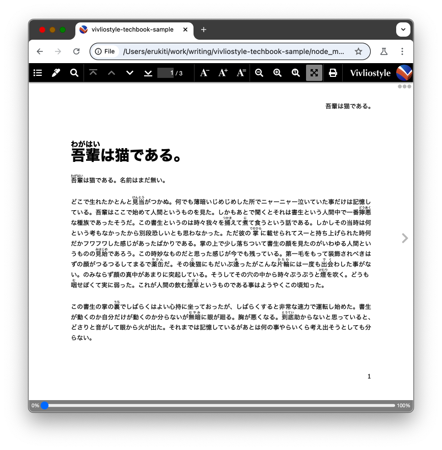

# VivlioStyleで普通にセットアップをする

## create-bookで、本のディレクトリを作成する

VivlioStyleは、必要なファイルがそろっている状態で `vivliostyle build` もしくは `vivliostyle preview` コマンドで実行できます。ところが、この必要なファイルを用意するのは面倒なので普通は `create-book` というツールを使ってファイルを作成します。

コマンドは `npx create-book <ディレクトリ名>` です。試しに `vivliostyle-techbook-sample` というディレクトリ名で作ってみます。注意点として `choose theme` では `@vivliostyle/theme-techbook` を選択しましょう。

```sh
% npx create-book vivliostyle-techbook-sample
Need to install the following packages:
create-book@1.1.3
Ok to proceed? (y) y
? Description description
? Author name erukiti
? Author email erukiti+github@gmail.com
? License MIT
? choose theme @vivliostyle/theme-techbook - Techbook (技術同人誌) theme

Creating a new package in /Users/erukiti/work/writing/vivliostyle-techbook-sample.

Initializing a git repository
> git init

Installing dependencies using npm
> npm install

added 697 packages, and audited 698 packages in 35s

188 packages are looking for funding
  run `npm fund` for details

4 high severity vulnerabilities

To address all issues (including breaking changes), run:
  npm audit fix --force

Run `npm audit` for details.

Successfully created /Users/erukiti/work/writing/vivliostyle-techbook-sample

1. cd vivliostyle-techbook-sample
2. create and edit Markdown files
3. edit entry field in your vivliostyle.config.js
4. yarn build or npm run build

See https://docs.vivliostyle.org for further information.

🖋 Happy writing!

% cd vivliostyle-techbook-sample
% ls -al
total 648
drwxr-xr-x   11 erukiti  staff     352  1  5 22:21 .
drwxr-xr-x    8 erukiti  staff     256  1  5 22:20 ..
drwxr-xr-x    9 erukiti  staff     288  1  5 22:20 .git
-rw-r--r--    1 erukiti  staff    2047  1  5 22:20 .gitignore
-rw-r--r--    1 erukiti  staff    1078  1  5 22:20 LICENSE
-rw-r--r--    1 erukiti  staff     500  1  5 22:20 README.md
-rw-r--r--    1 erukiti  staff    6175  1  5 22:20 manuscript.md
drwxr-xr-x  476 erukiti  staff   15232  1  5 22:21 node_modules
-rw-r--r--    1 erukiti  staff  299788  1  5 22:21 package-lock.json
-rw-r--r--    1 erukiti  staff     352  1  5 22:20 package.json
-rw-r--r--    1 erukiti  staff    1705  1  5 22:20 vivliostyle.config.js
```

VivlioStyleに必要なファイルは

* `package.json`
* `vivliostyle.config.js`
* あとは原稿ファイル（このサンプルでは `manuscript.md`）

です。

この状態で `npm run preview` を実行するとChromeに似たChromiumというOSSのブラウザが起動し{吾輩|わがはい}は猫である。を表示するプレビュー画面が表示されます。

{width=100%}

原稿ファイルである `manuscript.md` には、著作権フリーである「{吾輩|わがはい}は猫である。」の冒頭部分がMarkdownで書かれています。

    # {吾輩|わがはい}は猫である。

    {吾輩|わがはい}は猫である。名前はまだ無い。
    ...(後略)

このファイルを触り続けてもいいですが色々と不便なので、設定ファイルをいじった上で、技術書っぽくしていきましょう。

<!-- たぶん、削れるようになるはず。。。 -->
<div class="column">
<div class="column-title">Windowsでビルドできるまで</div>


<div class="flush-right">おやかた@oyakata2438</div>

Windows環境で、この原稿をローカルでビルドできるようになるまでにインストールしたパッケージは以下の通り。


* Vivliostyle
* BUN
* Node.js
* VFM
* Playwright

```sh
> npm install -g @vivliostyle/cli
> powershell -c "irm bun.sh/install.ps1 | iex"
> Node.jsはhttps://nodejs.org/en/download にインストーラーがある。
> bun install @vivliostyle/vfm
> npx playwright install
```

ビルドコマンド:
> bun run build

環境にもよるし、これから変わるかも…だけど、備忘録として。
</div>

## 設定を変更する

さてVivlioStyleの設定は主に`vivliostyle.config.js`を編集します。

筆者のおすすめ設定を書いておきます。

```js
module.exports = {
  title: 'vivliostyle-techbook-sample', // populated into `publication.json`, default to `title` of the first entry or `name` in `package.json`.
  author: 'あなたの名前', // default to `author` in `package.json` or undefined.
  language: 'ja', // default to undefined.
  size: 'A4', // paper size. A4 or JIS-B5
  theme: '@vivliostyle/theme-techbook@^2.0.0', // .css or local dir or npm package. default to undefined.
  entry: [
    'chap-hoge.md', // `title` is automatically guessed from the file (frontmatter > first heading).
  ], // `entry` can be `string` or `object` if there's only single markdown file.
  entryContext: './contents', // default to '.' (relative to `vivliostyle.config.js`).
  output: [ // path to generate draft file(s). default to '{title}.pdf'
    './output.pdf', // the output format will be inferred from the name.
  ],
  workspaceDir: '.vivliostyle', // directory which is saved intermediate files.
  toc: true, // whether generate and include ToC HTML or not, default to 'false'.
}
```

* `title` は本のタイトルです。
* `author` は著者の名前を書いてください。
* `language` は日本語 `ja` を指定してください。
* `size` は原稿の判型で `A4` か `JIS-B5` が一般的です。
* `theme` は先ほどインストール済みのはずなので、いったん変更しなくても大丈夫です。
* `entry` は原稿のファイルを示す項目です。適当に自分が分かりやすい名前を付けてください。
* `entryContext` は原稿ファイルを、どこかのディレクトリに入れるための設定です。この場合は`./contents/chap-hoge.md` に原稿があるというふうに認識されるようになります
* `output` は出力ファイル名、かつ、別形式のデータ(EPUBなど)を出力するための設定です。いったん `output.pdf` 煮出してしまいましょう。なるべく分かりやすく、かつ英数字で名前を付ける方が安全です。日本語ファイル名だと分かりやすいですが、色々なトラブルに発展しやすいです。
* `workspaceDir` は生成途中のものを出力するディレクトリです。これを指定しておかないと同じディレクトリに急に不要なファイルが大量に発生するため、絶対に設定した方がいいです。ちなみに初期状態でプレビューを実行すると `manuscripts.html` という不要なファイルができているはずです。
* `toc` は目次の生成をするかどうか？の設定です。

さて、この設定をした上で `contents` というディレクトリを作成して、`contents/chap-hoge.md` を書いてみましょう。もちろん、すでにある `manuscripts.md` からコピペしてきてもいいでしょう。その上で再度プレビューを開きましょう。たぶん、設定ファイルを変更したときに既存のプレビューは落ちているはずです。

1. タイトルの入った扉
2. 目次
3. `chap-hoge.md`に書いた内容

がそれぞれ書かれたプレビューがでてくるはずです。

<div class="column">
<div class="column-title">初期設定のプレビューで生じる生成物</div>
初期設定で生じる生成物を紹介しておきます。

* manuscript.html
* publication.json
* themes/

これらは `workspaceDir` の設定を修正すると、もれなくそっちのディレクトリ下に生成されるようになるので、不要になります。
</div>

あとVivlioStyleの `create-book` は `git` を設定しようとしますが `.gitignore` は不完全です。

```
# VivlioStyle

.vivliostyle
/*.pdf
```

を追加しておきましょう。

これで初期セットアップの最低限はできたはずです。gitにコミットしておきましょう。

```sh
% git add .
% git status
On branch main

No commits yet

Changes to be committed:
  (use "git rm --cached <file>..." to unstage)
	new file:   .gitignore
	new file:   LICENSE
	new file:   README.md
	new file:   contents/chap-hoge.md
	new file:   package-lock.json
	new file:   package.json
	new file:   vivliostyle.config.js

% git commit
[main (root-commit) 7b656e2] init
 7 files changed, 7845 insertions(+)
 create mode 100644 .gitignore
 create mode 100644 LICENSE
 create mode 100644 README.md
 create mode 100644 contents/chap-hoge.md
 create mode 100644 package-lock.json
 create mode 100644 package.json
 create mode 100644 vivliostyle.config.js
```

余計なファイルを削っていれば、７ファイルがコミットされるはずです。バージョンが変わると話は変わってくるかもしれません。
