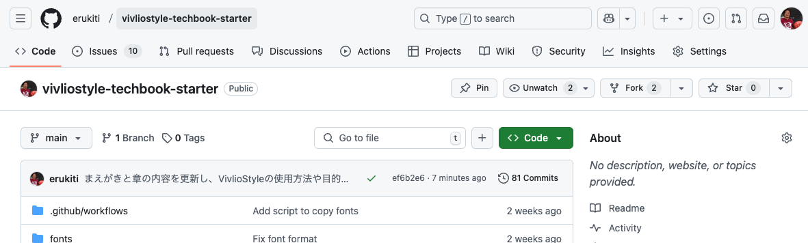
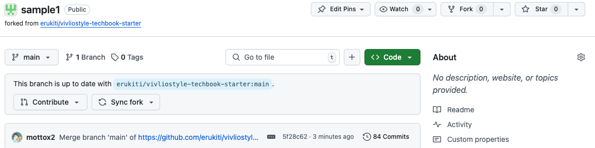

# セットアップ

<div class="flush-right">@erukiti</div>

ViviloStyleはJavaScriptで書かれたソフトウェアです。そのため、VivlioStyleを使うためにはJavaScript環境を構築する必要があります。JavaScriptを動かすためにNode.jsが必要です。

## システムにNode.jsをインストールする

最新のLTSというバージョンをいい感じにインストールしてください。既にNode.jsがある人はスキップしても大丈夫です。

* https://nodejs.org からダウンロードする


`Download Node.js (LTS)`ボタンが一つしかないため迷うことはないと思います。

もし何かしらのトラブルがあった場合はChatGPTやClaude・Geminiのような生成AIに質問するなり、なんなりしてなんとか解決してください。本書はJavaScriptの本ではないため、詳しい説明は省略させていただきます。

## まずリポジトリを作る

本の原稿を履歴管理するためにgitのリポジトリを作成します。一番手っ取り早いやり方は、本書のリポジトリ<span class="footnote">https://github.com/erukiti/vivliostyle-techbook-starter</span>のforkです。



forkしたいGitHubリポジトリの画面で「Fork (2)」と書かれたボタンを押すとfork画面が出てきます。


fork画面では、誰のリポジトリにしたいのかオーナーを選び、リポジトリの名前を入力します。リポジトリの名前は本の名前なので、たとえばReactで世界征服する本なら `react-conquer-the-world` みたいな名前になるでしょうか。それらを入力したら `Create fork` ボタンを押せばforkが完了です。少し時間がかかります。



詳しくはGitHubの使い方を覚えてください。

### 確認する

ここまでの作業で、今あなたが手に取っている本の内容そのものがPDFとして生成されるようになっています。

まずはローカルで実際にPDFが構築できるか確認してみましょう。たとえば、リポジトリは `git@github.com:erukiti/sample1.git` だとします（このリポジトリは存在しません）。

```sh
% git clone git@github.com:erukiti/sample1.git
Cloning into 'sample1'...
remote: Enumerating objects: 573, done.
remote: Counting objects: 100% (181/181), done.
remote: Compressing objects: 100% (89/89), done.
remote: Total 573 (delta 89), reused 154 (delta 70), pack-reused 392 (from 1)
Receiving objects: 100% (573/573), 39.38 MiB | 9.70 MiB/s, done.
Resolving deltas: 100% (277/277), done.
```

このようにして、手元に `sample1` というディレクトリができたはずです。出来ていない場合は、gitやGitHubの使い方をなんとかして頑張って身につけてみてください。

```sh
% cd sample1
% npm i
npm warn deprecated inflight@1.0.6: This module is not supported, and leaks memory. Do not use it. Check out lru-cache if you want a good and tested way to coalesce async requests by a key value, which is much more comprehensive and powerful.
中略

added 858 packages, and audited 859 packages in 5s

210 packages are looking for funding
  run `npm fund` for details

4 high severity vulnerabilities

To address all issues (including breaking changes), run:
  npm audit fix --force

Run `npm audit` for details.
```

`sample1`ディレクトリに移動し `npm i` でVivlioStyleを動かすのに必要なパッケージをインストールします。色々警告が出ますが、いったんそういうものとしてください。これが完了するとPDF生成するための準備ができました。

`npm run build` コマンドで電子版PDFが作成できました。

```sh
% npm run build

> vivliostyle-book-sample@0.0.0 build
> vivliostyle build -o online.pdf

✔ 00-title.md vivliostyle-sample
✔ 01-preface.md まえがき
✔ part-easy.md vivliostyle-sample
✔ chap-setup.md セットアップ
✔ chap-markdown.md Markdown
✔ chap-build.md PDFを生成する
✔ chap-onestop.md 【保存版】　入稿までの手順
✔ part-tips.md vivliostyle-sample
✔ chap-vivliostyle.md VivlioStyleについて
✔ chap-theme.md テーマを作る
✔ chap-font.md フォントを設定する
✔ chap-toc.md 目次を制する
✔ chap-mermaid.md Mermaidで図を書く
✔ chap-markdown-extra.md markdown応用編
✔ chap-sample.md サンプルと書式
✔ 90-postscript.md あとがき
✔ 98-authors.md 著者紹介
✔ 99-colophon.md vivliostyle-sample
⊙ Processing PDF
online.pdf has been created.
🎉 Built successfully.
```

`Built successfully.` がでてくれば、そのディレクトリにPDFが生えているはずです。最近のVSCodeはPDFのプレビュー機能もあるため、それで簡易的に確認できます。

さて、ここまでで、本書と同じ物を作れることを確認できましたね。重要なマイルストーンを一つクリアできました。

### 設定を変更する

このままでは本書と同じ内容の本を作ってしまうことになります。そのため、まずは本の設定を変えましょう。

VivlioStyleでは、本のタイトル、本のサイズ、原稿ファイル名などはすべて `vivliostyle.config.js` に記述されています。

|設定名|内容|
|-----|----|
|title|タイトルなんですが標準だと色々なところに埋め込まれて、日本語名を使うと問題が生じることがあるという噂なので、英数字とハイフンくらいに限定して方がいいかもしれません。ただしこのリポジトリの手法でPDFを生成するだけなら何を設定してもしなくても問題はないはずです。|
|author|著者名と連絡先です。ただしこれもこのリポジトリの手法でPDFを生成するだけなら何を設定してもしなくても問題はないはずです。|
|language|`ja`が日本語です。|
|size|ある程度大きな教科書サイズが`A4`で、最近流行の小さいサイズの技術書が`JIS-B5`です。`B5`は国際標準の方なので罠です。|
|entry|ここに原稿ファイル名を書いてください。ここに書いてないファイル名は参照されません。|

設定アイルは基本的に生成結果には、まだあまり影響を与えません。

### それぞれの原稿ファイルについて軽く見ていく

TBD

### CIでPDFが自動生成されているか確認する

TBD

