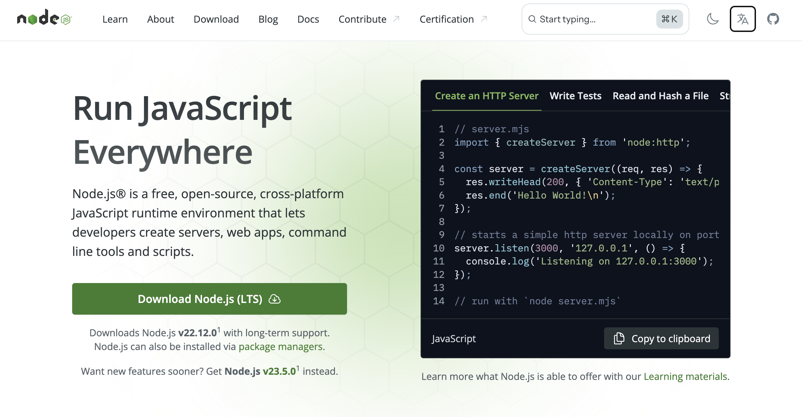
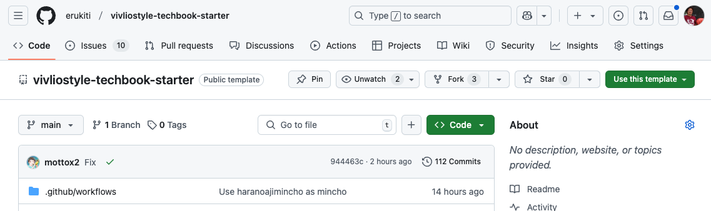
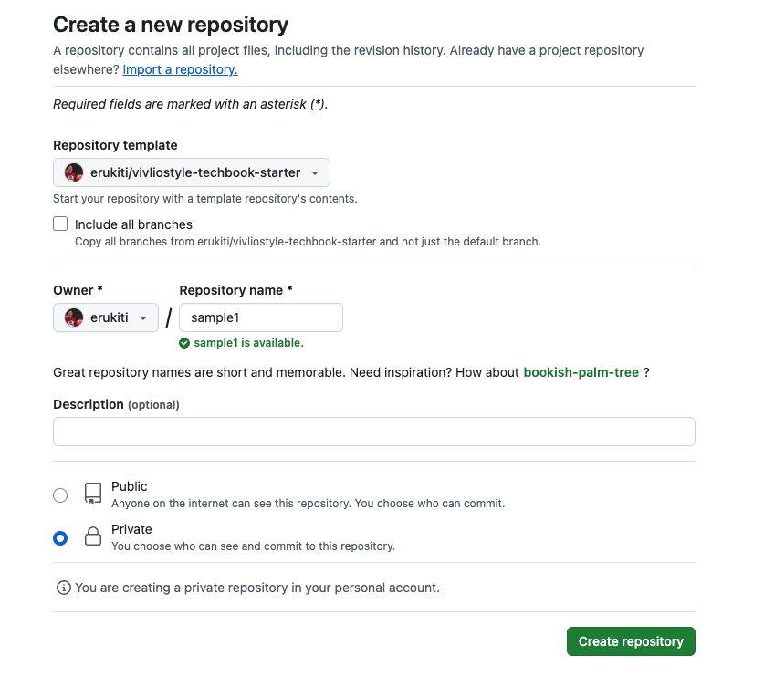
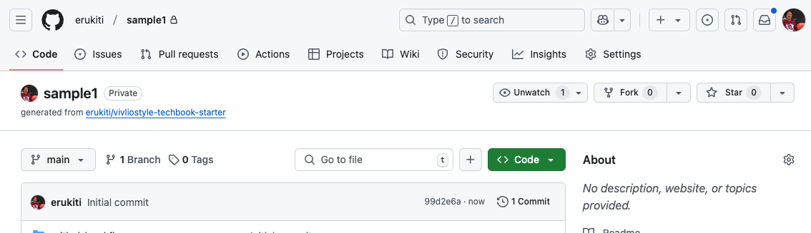
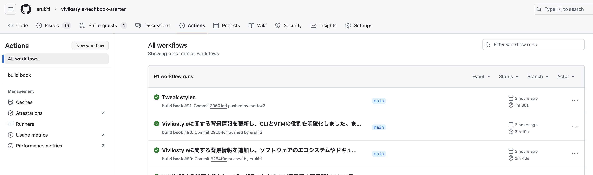
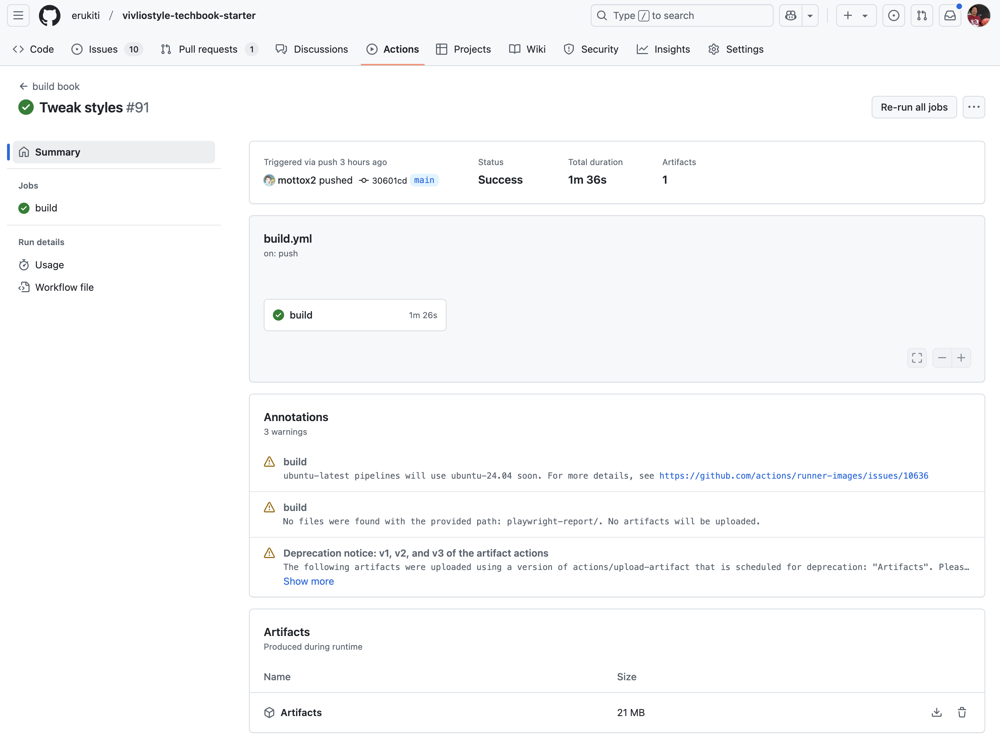
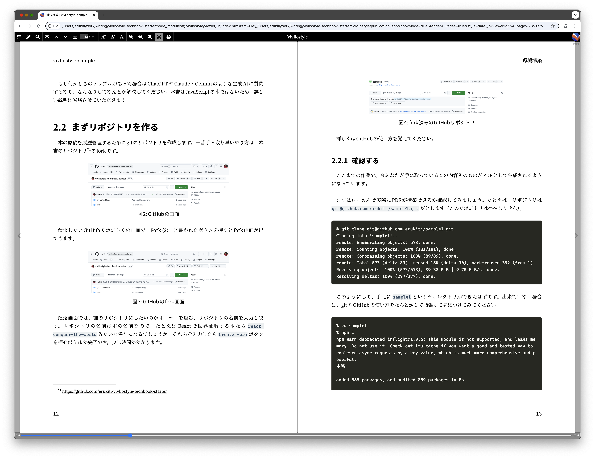

# 環境構築

ViviloStyleはJavaScriptで作られたソフトウェアであり、動作時にJavaScrpit処理系としてNode.jsが必要です<span class="footnote">一応主な処理はBunでも動作しますが、一部の処理がNode.js依存があるため、Bunだけでは動作ができないためNode.jsをインストールするのが現状では確実です。</span>。

また、原稿ファイルを編集するためにテキストエディタが必要です。頑張ればWindowsのメモ帳でもなんとかなるかもしれませんが、素直にVisual Studio Codeなどをインストールしてしまいましょう。

## システムにNode.jsをインストールする

https://nodejs.org から最新のLTS<span class="footnote">LTSはLong Term Supportの略で、Node.jsの最新安定版です。毎年10月頃にLTSの新しいバージョンが登場し、そのバージョンは2年半はメンテナンスされることが保証されています。</span>というバージョンのNode.jsをダウンロードしてインストールしてください。既にNode.jsが動いている人はスキップしても大丈夫です。

{width=90%}

`Download Node.js (LTS)`ボタンが一つしかないため迷うことはないと思います。

## まずリポジトリを作る

本の原稿を履歴管理するためにgitのリポジトリを作成します。一番手っ取り早いやり方は、本書のリポジトリ<span class="footnote">https://github.com/erukiti/vivliostyle-techbook-starter</span>はテンプレートリポジトリなので、



`use this template`と書かれたボタンを押して `create a new repository` を選択すると、テンプレートを元にリポジトリを作成可能です。



リポジトリ作成画面では、誰のリポジトリにしたいのかオーナーを選び、リポジトリの名前を入力します。リポジトリの名前は本の名前なので、たとえばReactで世界征服する本なら `react-conquer-the-world` みたいな名前になるでしょうか。本を全世界に公開したいならPublicを選択し、そうじゃなければprivateを選択し `create repository` ボタンを押しましょう。



これで、リポジトリができあがりました。

## 確認する

ここまでの作業で、今あなたが手に取っている本の内容そのものがPDFとして生成されるようになっています。

まずはローカルで実際にPDFが構築できるか確認してみましょう。たとえば、リポジトリは `git@github.com:erukiti/sample1.git` だとします（このリポジトリは存在しません）。

```sh
% git clone git@github.com:erukiti/sample1.git
Cloning into 'sample1'...
remote: Enumerating objects: 573, done.
remote: Counting objects: 100% (181/181), done.
remote: Compressing objects: 100% (89/89), done.
remote: Total 573 (delta 89), reused 154 (delta 70), pack-reused 392 (from 1)
Receiving objects: 100% (573/573), 39.38 MiB | 9.70 MiB/s, done.
Resolving deltas: 100% (277/277), done.
```

このようにして、手元に `sample1` というディレクトリができたはずです。出来ていない場合は、gitやGitHubの使い方をなんとかして頑張って身につけてみてください。

```sh
% cd sample1
% npm i
npm warn deprecated inflight@1.0.6: This module is not supported, and leaks memory. Do not use it. Check out lru-cache if you want a good and tested way to coalesce async requests by a key value, which is much more comprehensive and powerful.
中略

added 858 packages, and audited 859 packages in 5s

210 packages are looking for funding
  run `npm fund` for details

4 high severity vulnerabilities

To address all issues (including breaking changes), run:
  npm audit fix --force

Run `npm audit` for details.
```

`sample1`ディレクトリに移動し `npm i` でVivliostyleを動かすのに必要なパッケージをインストールします。色々警告が出ますが、いったんそういうものとしてください。これが完了するとPDF生成するための準備ができました。

`npm run build` コマンドで電子版PDFが作成できました。

```sh
% npm run build

> vivliostyle-book-sample@0.0.0 build
> vivliostyle build -o screen.pdf

✔ 00-title.md vivliostyle-sample
中略
✔ 99-colophon.md vivliostyle-sample
⊙ Processing PDF
online.pdf has been created.
🎉 Built successfully.
```

`Built successfully.` がでてくれば、そのディレクトリにPDFが生えているはずです。最近のVSCodeはPDFのプレビュー機能もあるため、それで簡易的に確認できます。

さてここまでで、本書と同じ物を作れることを確認できましたね。重要なマイルストーンを一つクリアできました。

## 設定を変更する

このままでは本書と同じ内容の本を作ってしまうことになります。そのため、まずは本の設定を変えましょう。

Vivliostyleでは、本のタイトル、本のサイズ、原稿ファイル名などはすべて `vivliostyle.config.js` に記述されています。

|設定名|内容|
|-----|----|
|title|タイトルなんですが標準だと色々なところに埋め込まれて、日本語名を使うと問題が生じることがあるという噂なので、英数字とハイフンくらいに限定して方がいいかもしれません。ただしこのリポジトリの手法でPDFを生成するだけなら何を設定してもしなくても問題はないはずです。|
|author|著者名と連絡先です。ただしこれもこのリポジトリの手法でPDFを生成するだけなら何を設定してもしなくても問題はないはずです。|
|language|`ja`が日本語です。|
|size|ある程度大きな教科書サイズが`A4`で、最近流行の小さいサイズの技術書が`JIS-B5`です。`B5`は国際標準の方なので罠です。|
|entry|ここに原稿ファイル名を書いてください。ここに書いてないファイル名は参照されません。|

設定アイルは基本的に生成結果には、まだあまり影響を与えません。

## それぞれの原稿ファイルについて

原稿ファイルは `src` ディレクトリの中にファイルがすべて入っています。このディレクトリの中のファイルはOSSとはしていないため、中身をそのまま使うことはおやめください。作りを真似るのはかまいませんが、あなた自身が本を作らなければなりません。

本書では、通常の章はMarkdownで記述していますが、いわゆる扉といわれるタイトルページや、部を示すページなどはHTMLを使っています。

実際のところ、通常の組版が必要なページは普通の流れに任せた方が楽ですが、扉のようなレイアウトは、あまり通常のやり方に固執せず、サクサクとHTML+CSSを構築した方が楽かも知れません。

また、本書ではファイル名に一定のルールを設定しています。

* いわゆる扉や前書き・後書き・著者紹介・奥付などは数字始まりのファイル名 `00-title.md` など
* 通常の章は `chap-xxxx.md` のように `chap-` で始まるファイル名
* 第一部・第二部などは `part-xxxx.md` のように `part-` で始まるファイル名

というようにしています。

## 印刷用のPDFを作成する

`npm run build` で作成したPDFはデジタル環境向けのものでタブレットなどの画面で見ることを想定しています。ソースコードがプリティプリントと呼ばれる、構文を際立たせる色分けなどをはじめとして、カラー前提です。

ところが、印刷所に出すPDFはフルカラーだと印刷代金がかかりすぎるため1色刷をするのが一般的なことと、フォントのアウトライン化など、印刷向けのPDFにしなければ、印刷所が受け付けてくれない可能性があります。

`npm run build -- --press-ready` もしくは `npm run build:press-ready` コマンドで印刷向けのPDFを作成できます。ただし、このコマンドを実行するときにはDockerが必要となります。

```md
% bun run build:press-ready
$ vivliostyle build --press-ready -o print.pdf
✔ 00-title.md vivliostyle-sample
中略
✔ 99-colophon.md vivliostyle-sample
🚀 Running press-ready
📦 Launching docker container
==> Listing fonts in '/data/var/folders/mp/2fv3s_1j6wvddl60_xv7bz700000gn/T/vivliostyle-cli-3207a6c0-d5d4-11ef-95f3-a34d917e92e2.pdf'
name                          type          embedded  subset
[none]                        Type 3        yes       no
中略
BAAAAA+IBMPlexSerif-Regular   CID TrueType  yes       yes
==> Some fonts need to be outlined
==> Generating PDF
Input            /data/var/folders/mp/2fv3s_1j6wvddl60_xv7bz700000gn/T/vivliostyle-cli-3207a6c0-d5d4-11ef-95f3-a34d917e92e2.pdf
Output           /data/Users/erukiti/work/writing/vivliostyle-techbook-starter/print.pdf
Color Mode       CMYK
Enforce outline  yes
Boundary boxes   no
==> Ghostscript: Done without error
==> Listing fonts in '/data/Users/erukiti/work/writing/vivliostyle-techbook-starter/print.pdf'
==> No fonts found
==> Every font is properly embedded
ℹ Processing PDF
◡ Processing PDF
print.pdf has been created.
🎉 Built successfully.
```

この長ったらしいコマンドでは、pdffontsというコマンドを使ってフォントの埋め込み状況を確認して、必要があればアウトライン化などの処理を行っています。

通常のPDF作成と同じく `🎉 Built successfully.` が表示されていれば、成功しているはずです。

## PDFが印刷所対応かを確認する

確認する方法としては、Adobe Acrobat Reader を使う方法と、Xpdfというソフトに含まれる `pdffonts` というコマンドを使う方法があります。筆者はAdobe Acrobat Readerを使っていないため、pdffontsでのやり方を書きます。

MacでHomebrewを使っているなら`brew install xpdf`でインストールができます。インストールしたあとは一度ターミナルを抜けないと、インストールされたコマンドを認識してくれないことがあるため要注意です。ターミナルを立ち上げ直すと `pdffonts output.pdf` で確認ができるはずです。

```
% pdffonts screen.pdf
name                                           type              emb sub uni prob object ID
---------------------------------------------- ----------------- --- --- --- ---- ---------
AAAAAA+Verdana-Bold                            CID TrueType      yes yes yes           4  0
BAAAAA+Verdana                                 CID TrueType      yes yes yes           5  0
CAAAAA+Verdana-Bold                            CID TrueType      yes yes yes           8  0
[none]                                         Type 3            yes no  yes           9  0
省略
```

このコマンドはフォントの設定を行ったときに特に重要です。せっかく組版するのだから使いたいフォントを指定したとして、そのフォントが正しく使われているかを確認する必要があります。そういうときに使うと、フォントの名前を確認できます。nameに`[none]` と表示されていますが、これはVivliostyleがPDFを生成するときに使うChromiumの特殊なものが使われているためで、特に問題はありません。

今回は試しにデジタル版のPDFで試した結果こうなっています。このときembにnoがなければ印刷所に投げても問題のないPDFです。もしemvのnoのものがあると、印刷所から「フォント埋め込んでください」という電話がかかってくることになるでしょう。

press-readyで作成したPDFの場合はどうでしょうか？

```
% pdffonts print.pdf
name                                           type              emb sub uni prob object ID
---------------------------------------------- ----------------- --- --- --- ---- ---------
```

そもそもフォントをすべてアウトライン化しているため、PDFの中にフォント情報は存在していません。

## CIでPDFが自動生成されているか確認する

この本のリポジトリは、GitHub Actions用の設定がされているため、GitHub上でCIが自動で動いてPDFが作成されているはずです。



それぞれのアクション結果をクリックするとアクションの詳細画面に遷移するので、最下部にある Artifacts をダウンロードしてみましょう。



Artifacts.zipというファイルがダウンロードできるはずです。zipを展開すると、印刷用とデジタル用のそれぞれのPDFが出てくるはずです。

PDFがローカルで作成したものと同じように見えるか見比べましょう。特にフォントが変わってるかもしれません。

これが、うまく動いていることが確認できれば、複数人で同人誌を書くときにめちゃくちゃ捗るようになります。

## プレビューのやり方

`npm run build` でPDFを作成する以外にも `npm run preview` で、ビルドするよりは早く原稿を確認することができます。



プレビュー画面は、ファイル更新を検知し自動でビルドしなおしてくれます。横幅を広げると見開きで表示してくれるのでイメージがしやすいでしょう。


